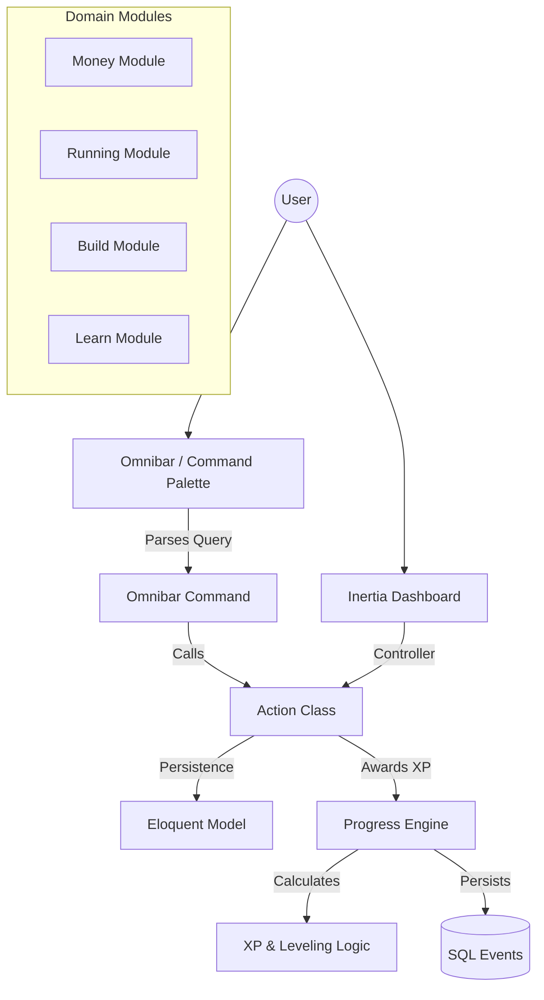

# Life OS

A gamified, modular productivity platform built with Laravel and Vue.js. Life OS consolidates personal management across finance, fitness, learning, and project building into a single command-center experience, driven by an XP-based progression system.

## 🏗️ Architecture

Life OS follows a **modular monolith** architecture. Each domain module (Money, Running, Build, Learn) is self-contained with its own models, controllers, actions, and frontend components, while sharing a cross-cutting **Progress Engine** for XP tracking and gamification.

### System Design



### Key Design Decisions

- **Action Classes** — Business logic lives in single-purpose Action classes (`LogRunAction`, `FundGoalAction`, etc.), keeping controllers thin and operations testable in isolation.
- **API Resources** — Every response is transformed via Eloquent API Resources, decoupling the database schema from the frontend data contract.
- **Scoped Tenant Logic** — All domain models share a `BelongsToUser` trait, enforcing strict ownership and authorization via a global `forUser()` query scope.
- **Omnibar Registry** — A command palette (Ctrl+K) that uses regex pattern matching to route natural language commands to dedicated Command classes.
- **XP Economy** — Every meaningful action awards XP. Anti-spam measures ensure duration-based rewards (e.g., study sessions under 10 minutes award no XP).

---

## 📦 Modules

### 💰 Money
Personal finance ledger with income/expense tracking, savings goals with visual funding progress, recurring subscription management, and automated billing cycle processing.

### 🏃 Running
Training plan engine supporting both curated templates and custom plans. Features a weekly calendar view, workout scheduling, automatic run-to-workout matching, and completion tracking with partial credit.

### 🔨 Build
Project and task management with blocker prioritization. Supports project templates (Software, Content) for quick scaffolding, task status tracking, and activity logging.

### 📚 Learn
Knowledge tracking for books, courses, articles, and podcasts. Reading/study sessions with position bookmarking, unit-based progress, and a revision queue for completed resources.

---

## 🛠️ Tech Stack

| Layer | Technology |
|-------|-----------|
| **Backend** | Laravel 11 (PHP 8.3) |
| **Frontend** | Vue 3 (Composition API) |
| **Testing** | Pest PHP |
| **Bridge** | Inertia.js (SSR Ready) |
| **Styling** | Tailwind CSS |
| **Database** | SQLite |

---

## 🚀 Getting Started

### Prerequisites
- PHP 8.3+
- Composer
- Node.js 20+

### Installation

```bash
# Clone and install
git clone <repo-url> life-os
cd life-os
composer install
npm install

# Setup environment
cp .env.example .env
php artisan key:generate

# Database & Demo Data
touch database/database.sqlite
php artisan migrate:fresh --seed --seeder=DemoSeeder

# Launch
npm run dev
```

### Running Tests

The project includes a comprehensive suite of **Pest** unit and feature tests.

```bash
# Run all tests
./vendor/bin/pest

# Run coverage (requires Xdebug)
./vendor/bin/pest --coverage
```

## 📜 Project Structure

```text
app/
├── Actions/           # Single-purpose business logic (Refactored from Controllers)
├── Enums/             # Type-safe status values (PHP 8.1+ Enums)
├── Http/
│   ├── Controllers/   # Thin delegators
│   ├── Resources/     # API Data Transformation layer
│   └── Requests/      # Validation logic
├── Models/            # Eloquent models with BelongsToUser trait
├── Traits/            # Shared behavioral logic (e.g., BelongsToUser)
└── Services/          # Complex singleton logic (ProgressEngine)
```

## ⚖️ License

MIT License.
